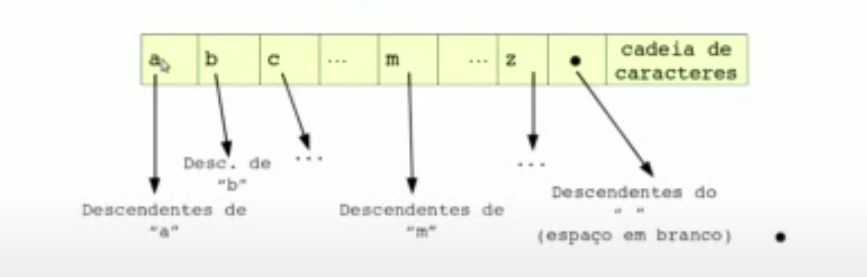
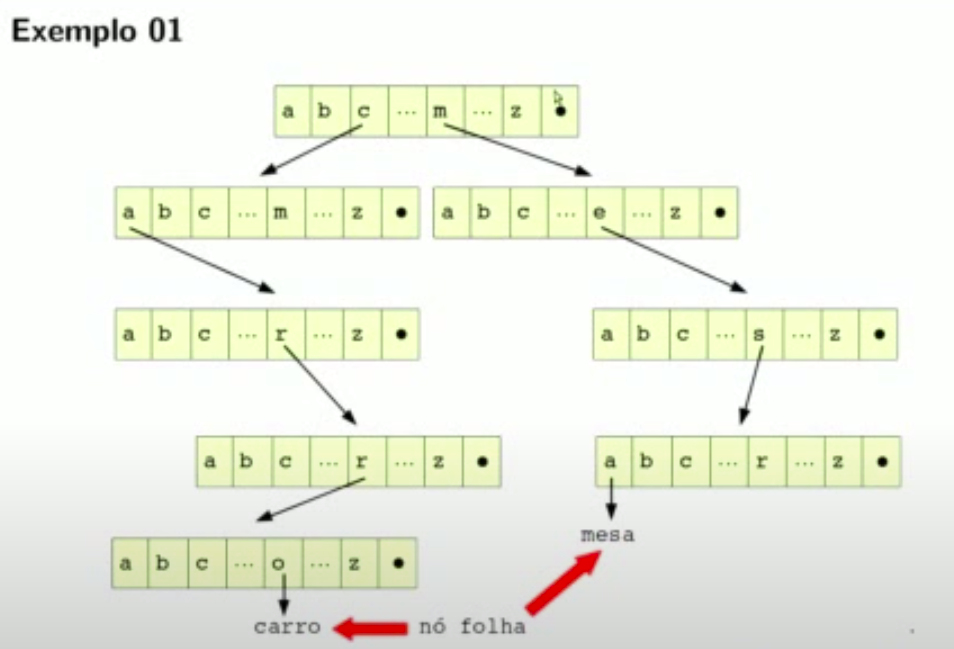

# Pesquisa em Árvores

## Árvore Digital de Pesquisa
* A Árvore Digital de Pesquisa foi primeiro descrita por René de la Briandais (File searching using variable length keys, Proceedings Western Joint Computer Conference, pp. 295-298. 1959)
* Recebeu também as seguintes denominações: trie, prefix tree e radix tree.
* O termo trie foi concedida por Edward Fredkin, tendo sua origem na palavra retrieval, indicando que se trata de uma estrutura de dados adequada para a recuperação de informações, especialmente vinculada a cadeias de caracteres.
* O sinônimo prefix tree advém do fato de que partir de um prefixo de cadeia, podem ser identificadas todas as cadeias que possuem aquele prefixo
* O termo radix tree possui a mesma origem do anterior: a partir da raiz da cadeia, ou seja, seus símbolos iniciais, é possível localizar todas as cadeias que possuem aquela raiz.

* Trie
  * Árvore multidirecionar (caso particular) que é utilizada para armazenar um conteúdo dinâmico de dados.
  * Normalmente é uma cadeia de caracter.
  * Diferentemente da árvore binária de pesquisa, cada nó da árvore **não armazena** o valor da chave primária assossiada àquele nó. Ao invés disso, é a posição do nó na árvore que define a chave primária com a qual aquele nó está associado.
  * Cada nó da árvore contém um vetor de indicadores (ou ponteiros). Cada indicador está associado a um dos caracteres do alfabeto escolhido.
  * Um caractere da cadeia é armazenado em cada nível da árvore, sendo o primeiro caractere armazenado na raiz da árvore
  * Todos os descendentes de um nó possuem como prefixo comum a cadeia de caracteres associada àquele nó.
  * A raiz da árvore está associada à cadeia vazia.
  * Os nós folhas estão associados às cadeias de caracteres completas armazenadas na trie.
  * Por meio da organização anterior, uma trie é uma estrutura que permite que caideas de caracteres com prefixos idênticos sejam armazenadas de forma eficiente, pois somente é necessário o armazenamento da cauda (ou sufixo) da cadeia, e não toda ela.
  * Esta característica se mostrará muito conveniente para algumas aplicações.

* Considere o alfabeto formado pelas 26 letras itálicas e o espaço em branco

* São os nós folhas que armazenam as informações desejadas - as cadeias de caracteres completas (carro e mesa, por exemplo)
* Para acessar uma cadeia de caractere desejada é necessário mover-se, a partir do nó raiz, para baixo na trie, seguindo a subárvore apropriada de acordo com a ordem alfabética do caractere sendo processado naquele momento até atingir um nó folha;

