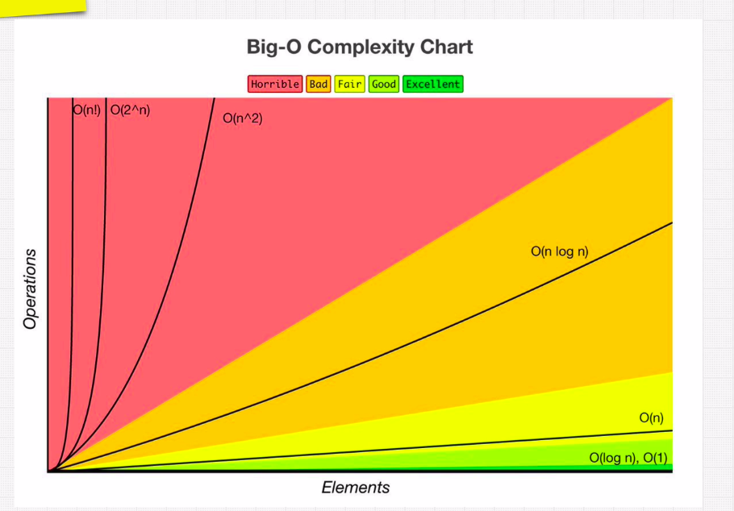
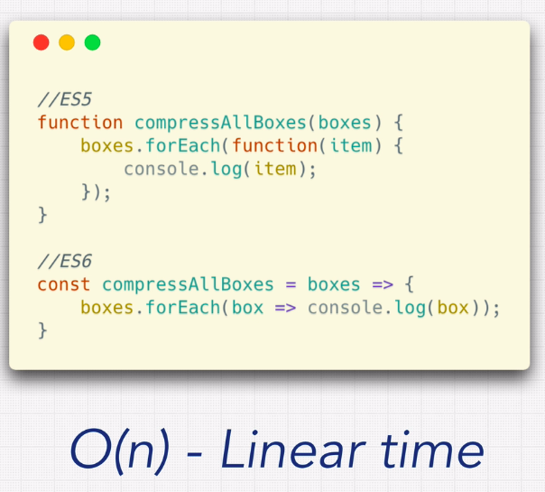
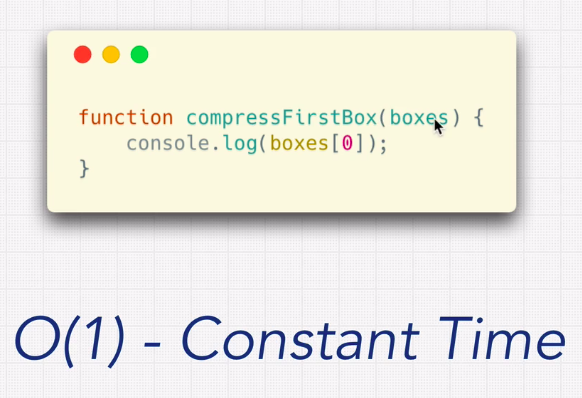
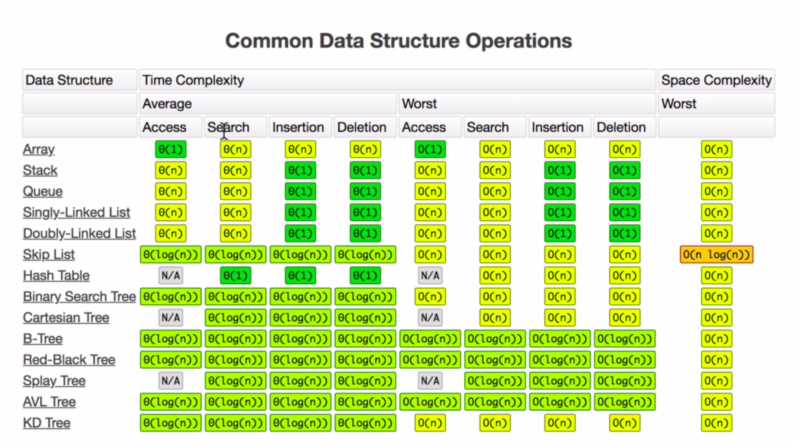

[Course Link](https://www.udemy.com/course/master-the-coding-interview-data-structures-algorithms)

[Programming in web - repl.it](https://replit.com/~)

# Big O Asymptotic Notation

## What is good code?
* 1 - Readable
* 2 - Scalable - Big O


```javascript
const nemo = ['nemo'];

function findNemo(array) {
  let t0 = performance.now();
  for(let i = 0; i < array.length; i++) {
    if(array[i] === 'nemo') console.log('Found NEMO');
  } 
  let t1 = performance.now();
  console.log('Call to find nemo took: ' + (t1-t0) + ' milliseconds');
}

findNemo(nemo); // O(n) ---> Linear Time

```


## Big O Complexity Chart



## O(n)


## O(1)


## Big O Calculation 2

```javascript
function anotherFunChallenge(input) {
  let a = 5; // O(1)
  let b = 10; // O(1)
  let c = 50; // O(1)
  for (let i = 0; i < input; i++) {
    let x = i + 1; //O(n)
    let y = i + 2; //O(n)
    let z = i + 3; //O(n)

  }
  for (let j = 0; j < input; j++) {
    let p = j * 2; //O(n)
    let q = j * 2; //O(n)
  }
  let whoAmI = "I don't know"; //O(1)
}

// BIG O = O(4 + 5n) = O(n)
```

## Simplifying Big O

* Rule book
  * Rule 1 - Worst Case
  * Rule 2 - Remove Constants
  * Rule 3 - Different Terms for inputs
  * Rule 4 - Drop Non Dominants

## Rule 1 - Worst Case
* Find some string and it string should be the last item.


## Rule 2 - Remove Constants
* You cant count constants as complexity
* Even loops with constants does't count
* Two separete loops = O(2n) = O(n)

## Rule 3 - Different terms for inputs

```javascript
function compressBoxesTwice(boxes, boxes2) {
  boxes.forEach(function(boxes) {
    console.log(boxes);
  });

  boxes2.forEach(function(boxes) {
    console.log(boxes);
  });
}

// It is not O(n)
// O(a + b) - Two different arrays

```

* O(n²)

```javascript
// Log all pairs of array

const boxes = ['a', 'b', 'c', 'd', 'e']

function logAllPairsOfArray(array) {
  for(let i = 0; i < array.length; i++) {
    for(let j = 0; j < array.length; j++) {
      console.log(array[i], array[j]);
    }
  }
}

logAllParisOfArray(boxes);

//a a
//a b
//a c
//a d
//a ...
//b a
//b b
//b ...
//...

```

* Nested loops we use multiplication
* This becomes O(n²)
* Quadratic

## Rule 4 - Drop Non Dominants

```javascript
function printAllNumbersThenAllPairSums(number) {
  console.log('These are the numbers:');
  numbers.forEach(function(number) {
    console.log(number);
  });

  console.log('and these are their sums: ');
  numbers.forEach(function(firstNumber) {
    numbers.forEach(function(secondNumber) {
      console.log(firstNumber + secondNumber);
    });
  });
}

printAllNumbersThenAllPairSums([1, 2, 3, 4,5, 6]);

O(n + n²) -- DROP THE n
O(n²)

```

## Big O Cheat Sheet:
* Big Os
  * O(1) Constant- no loops
  * O(log N) Logarithmic- usually searching algorithms have log n if they are sorted (Binary Search)
  * O(n) Linear- for loops, while loops through n items
  * O(n log(n)) Log Liniear- usually sorting operations
  * O(n^2) Quadratic- every element in a collection needs to be compared to ever other element. Two
nested loops
  * O(2^n) Exponential- recursive algorithms that solves a problem of size N
  * O(n!) Factorial- you are adding a loop for every element

* Iterating through half a collection is still O(n)
* Two separate collections: O(a * b)

* What can cause time in a function?
  * Operations (+, -, *, /)
  * Comparisons (<, >, ==)
  * Looping (for, while)
  * Outside Function call (function())

* Rule Book
  * Rule 1: Always worst Case
  * Rule 2: Remove Constants
  * Rule 3: Different inputs should have different variables. O(a+b). A and B arrays nested would beO(a*b)'+' for steps in order '* 'for nested steps
  * Rule 4: Drop Non-dominant terms

* What causes Space complexity?
  * Variables
  * Data Structures
  * Function Call
  * Allocations

* Big O Notation and Data Structures


* Data Structure - Way to store data
* Algorithms - Way to use data structures
* Data Structure + Algorithms = Programs

## O(n!) - Factorial time - The expensive one
* Nested loop for each input


## Space Complexity
* Two ways to store
* The heap and the stack
* Heap store variables
* Stack keep track on function calls
* How much memory is using

## Example

```javascript

function boo(n) {
  for(let i = 0; i <n.length; i++) {
    console.log('boooo!');
  }
}
boo([1, 2, 3, 4, 5, 6, 7]); //O(1)
```

```javascript

function arrayOfHiNTimes(n) {
  let hiArray = [];

  for(let i = 0; i<n; i++) {
    hiArray[i] = 'hi';
  }

  return hiArray;
}

arrayOfHiNTimes(6)// O(n)

```

# Search Digital Tree

## Trie
* Trie - Prefix Tree or Radix Tree
* Named by Edward Fredklin, and refers the word 'trie'
* Most used to search words in strings

* Prefix Tree - Radix Tree
  * search for prefix strings
  * Starting from root can find any character sequence

